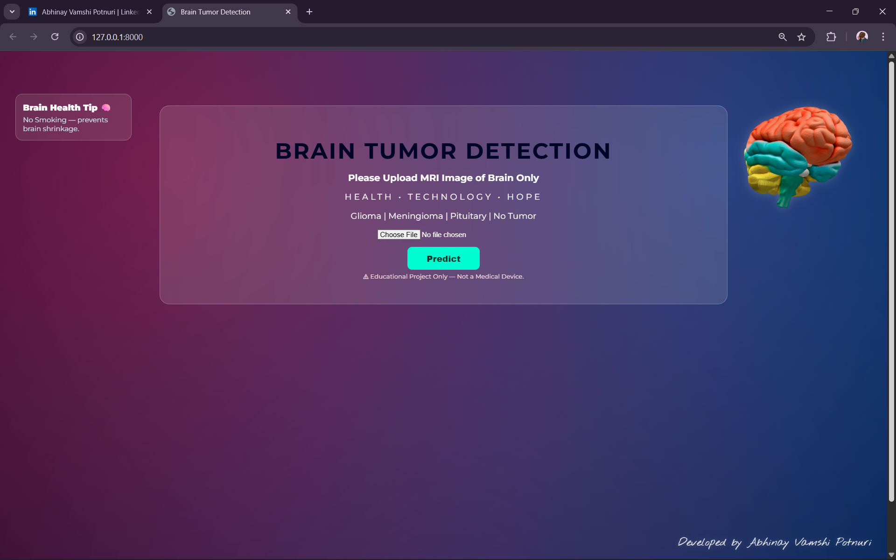
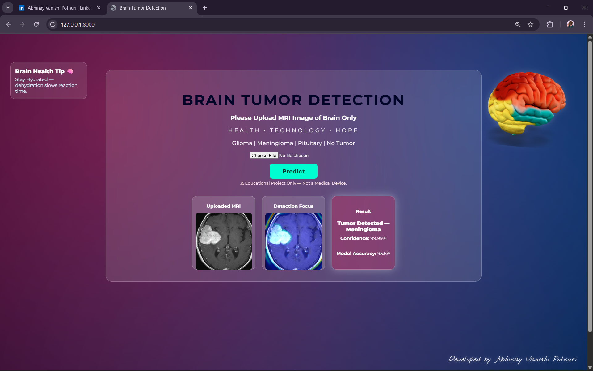

# 🧠 Brain Tumor Detection – Neural Vision in The Matrix

> “There is no spoon… only tensors.”  
> — Morpheus (…probably 😎)

When medicine meets machine intelligence.  
This project builds a Deep Learning powered system that scans **brain MRI images** and predicts:

- Glioma  
- Meningioma  
- Pituitary Tumor  
- **No Tumor (Safe)**  

Built using **Convolutional Neural Networks (CNN)** and wrapped inside a **Django web application**, this system acts like a **Neural Oracle** that stares into MRI scans and whispers the truth.

---

## 🟢 Matrix Terminal Activated — Screenshots

### 🏠 Home Interface


---

### 🔍 Tumor Detected


---

### ✅ No Tumor Found


---

## ☕ What This AI Really Does

✔ Upload Brain MRI Images  
✔ Processes them using CNN Model  
✔ Predicts Tumor Type  
✔ Displays Confidence Score  
✔ Clean and Simple UI for Doctors / Users  

*(Grad-CAM heatmap visualization — planned upgrade)*

---

## 🧬 Tech Stack
Python
TensorFlow / Keras
OpenCV
NumPy
Django
HTML / CSS / JavaScript


---

## 🎯 Why This Project Matters

This project isn’t “just another ML model”.  
It represents:

- Practical Medical AI
- Real-world Computer Vision
- End-to-End ML + Web App Integration
- Deployment Learning Experience
- Handling real datasets and model loading

Great for:

✔ Portfolio  
✔ Internships  
✔ Placements  
✔ ML Learning Journey  

---

## ⚙️ Run Locally — Escape The Matrix ☠️😅

Clone the repo:

```bash
https://github.com/AbhinayVamshi07/Brain-Tumor-Detection-Using-CNN-.git


